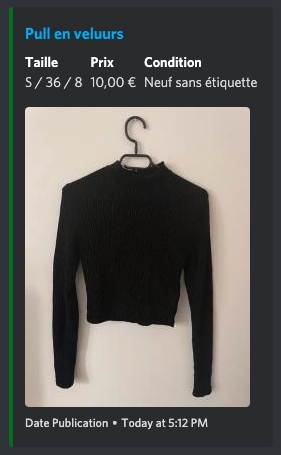

# Vinted Discord BOT

Un bot Discord pour Vinted, qui envoie un message lorsqu'une nouvelle annonce est publiée (selon certains critères).

## Abonnez-vous...

Pour s'abonner, entrez n'importe quelle URL Vinted. Le bot déterminera automatiquement les filtres à appliquer aux résultats.

## ...et recevez vos notifications !

## Distrobot.fr

Bien que le bot open source fonctionne parfaitement et soit très rapide, sa configuration et son installation peut être laborieuse. C'est pour cela que nous vous proposons également notre service https://distrobot.fr :

|                                             | **Bot open source** | **Distrobot** |
|---------------------------------------------|---------------------|---------------|
| Prix                                          | Gratuit                   |  à partir de 9.90€/mois             |
| Mises à jour régulières                     | ✅                   | ✅             |
| Recherches avancées                         | ✅                   | ✅             |
| Vitesse de synchronisation                  | 15s                 | < 5s            |
| En ligne 24/24 7/7                          |  ❌  (sauf VPS payant)                | ✅             |
| Utilisation de proxies (pour + de rapidité) |   ❌                  | ✅             |
| Configuration en 3 clics                    |   ❌                  | ✅             |
| Salons avec conseils de professionnels      |   ❌                  | ✅             |
| Soutien du projet                           |  ❌                   | ✅             |

## Installation du bot open source

**Je maintiens bénévolement ce bot sur mon temps libre. Si besoin, je suis également disponible pour aider pour l'installation sur [Twitter](https://twitter.com/androz2091).**

Prérequis :

* Node.js
* NPM

Installation :

* Installer les dépendances avec `npm install`
* Renommer le fichier `config.sample.json` en `config.json`
* Lancer avec `node index.js`
