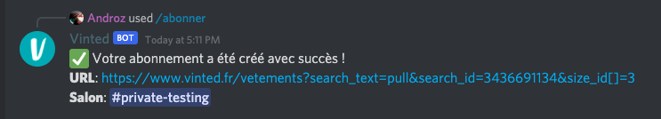
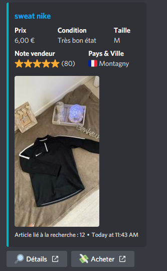

# Vinted Discord BOT

Un bot Discord pour Vinted, qui envoie un message lorsqu'une nouvelle annonce est publiée (selon certains critères).

## Abonnez-vous...

Pour s'abonner, entrez n'importe quelle URL Vinted. Le bot déterminera automatiquement les filtres à appliquer aux résultats.

## ...et recevez vos notifications !

## Installation

**Je maintiens bénévolement ce bot sur mon temps libre. Pour supporter ce projet, n'hésitez pas à [faire un don](https://paypal.com/andr0z). Si besoin, je suis également disponible pour aider pour l'installation sur [Twitter](https://twitter.com/2091_androz) si besoin.**

Prérequis :

* Node.js
* NPM

Installation :

* Installer les dépendances avec `npm install`
* Renommer le fichier `config.sample.json` en `config.json`
* Lancer avec `node index.js`
